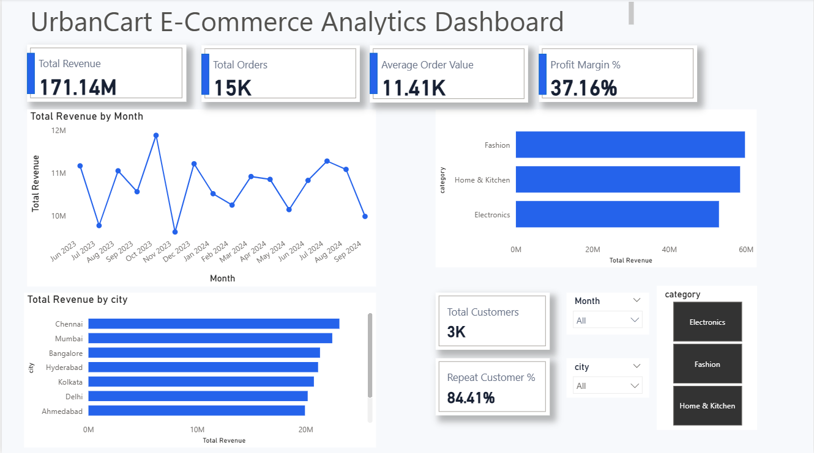

# UrbanCart E-Commerce Analytics: Diagnosing a Revenue Growth Plateau

**End-to-end data analytics project** using MySQL, Python (Pandas/NumPy), and Power BI to diagnose why a mid-sized e-commerce retailer's revenue growth had stalled — despite steady marketing spend.

---

## Business Problem

UrbanCart is a fictional mid-sized e-commerce retailer selling Electronics, Fashion, and Home & Kitchen products across 8 Indian cities. Over the past two quarters, leadership observed that **revenue growth had plateaued** despite consistent marketing investment. With no clear visibility into customer behavior, regional performance, or product trends, management needed a data-driven diagnosis before committing further budget to any single fix.

## Objective

Identify the root cause(s) of stalled revenue growth by systematically testing competing hypotheses against the data, and deliver actionable, evidence-backed recommendations — not assumptions.

## Tools Used

| Tool | Purpose |
|---|---|
| **MySQL** | Data storage, schema design, cleaning detection, 25-query business analysis (joins, CTEs, window functions) |
| **Python (Pandas, NumPy, Matplotlib)** | Data cleaning, outlier detection, hypothesis testing, EDA |
| **Power BI** | Data modeling (star schema), DAX measures, interactive dashboard |

## Data Architecture

Relational schema with `Order_Items` as the fact table and `Customers`, `Products`, `Orders`, `Deliveries` as dimension tables:

```
Customers (1) ──→ (*) Orders (1) ──→ (*) Order_Items (*) ←── (1) Products
                          (1) ──→ (1) Deliveries
```

~62,000 rows across 5 tables (Customers: 3,060 · Products: 150 · Orders: 15,000 · Order_Items: 28,876 · Deliveries: 15,000), spanning June 2023–September 2024.

**Deliberately realistic, messy data** — the dataset included missing values, duplicate records, inconsistent categorical text, and statistical outliers, simulating real-world data quality challenges rather than a clean tutorial dataset.

## Data Cleaning

| Issue | Detection Method | Resolution |
|---|---|---|
| 60 duplicate customer records | SQL `GROUP BY` + `HAVING`, NULL-safe join (`<=>`) | Merged order history to surviving record before deduplication — avoided silently deleting real transactions |
| 133 price entry errors (~8-10x inflation) | Python IQR outlier detection, validated against per-product price ratios | Replaced with clean product-level average price |
| Inconsistent city/category text (up to 4 spelling variants each) | SQL `SELECT DISTINCT` | Standardized via `CASE WHEN` (SQL) / `.replace()` (Python) |
| Missing values (email, city, segment, quantity, delivery_status) | Column-by-column `.isna()` checks | Context-specific: left NULL (email, cancelled-order deliveries), imputed with median (quantity), labeled "Unknown" (city, segment) |
| Referential integrity | Anti-join checks (orders↔customers, order_items↔products) | Verified 0 orphaned records — MySQL FK constraints held throughout |

## SQL Analysis

25 queries spanning SELECT/WHERE/CASE fundamentals through CTEs, window functions (RANK, LAG, running totals), and multi-table joins. Highlights include month-over-month revenue change, top-5-customers-per-city ranking, and a top-10%-customer-revenue-contribution query using `NTILE()` — cross-validated against Python results (84.45% vs. 84.41% repeat rate; 33% vs. 32.65% top-decile revenue share).

## Python Analysis — Hypothesis-Driven EDA

Rather than open-ended exploration, five specific hypotheses for the revenue plateau were tested against the cleaned data:

| Hypothesis | Result |
|---|---|
| Declining new customer acquisition | ❌ Rejected — signups steady at 173–226/month |
| Customers not repeat-buying | ❌ Rejected — 84.41% repeat purchase rate |
| Shrinking Average Order Value | ❌ Rejected — AOV flat at ₹10,850–12,230/month |
| One region dragging down the average | ❌ Rejected — moderate 25-30% spread, no outlier city |
| Delivery delays hurting retention | ❌ Rejected — only 2.6-point repeat-rate gap |
| **Revenue concentrated in top customers** | ✅ **Confirmed — top 10% of customers generate 32.65% of revenue** |

## Power BI Dashboard

Star-schema data model with a dedicated `DateTable` for reliable time-intelligence calculations. Dashboard includes:

- **KPI cards:** Total Revenue, Total Orders, Average Order Value, Profit Margin %
- **Monthly Revenue Trend** (line chart) — visualizes the flat/oscillating pattern
- **Revenue by Category** and **Revenue by City** (bar charts)
- **Customer metrics:** Total Customers, Repeat Customer %
- **Interactive slicers:** Month, City, Category


10 DAX measures built, including `DIVIDE()`-safe ratios, `SUMX`/`RELATED()` cost calculations, and time-intelligence (`SAMEPERIODLASTYEAR`, `DATEADD`) measures.

## Key Insights

1. Revenue growth has genuinely **stalled, not declined** — no single broken lever, just an absence of a growth driver.
2. Customer acquisition, repeat-purchase behavior, and AOV are all individually healthy — ruling out the most common assumed causes.
3. **The top 10% of customers generate ~33% of total revenue** — the strongest, most actionable finding, with direct implications for retention strategy.
4. Regional and category performance are both moderately balanced, with Pune and Electronics as the (mild) laggards worth a closer look.
5. Data quality issues (duplicates, price errors, inconsistent categories) were significant enough to materially change results if left uncorrected — validating the importance of the cleaning stage.

*(Full 10-insight list with Observation → Reason → Impact → Action framing available in the project write-up.)*

## Business Recommendations

- **Immediate:** Launch a VIP program for top-10% customers; fix city/category data entry with dropdowns; add price-entry validation.
- **Medium-term:** Build AOV-boosting bundle/upsell strategy; run a targeted growth pilot in Pune or Electronics; automate data-quality monitoring.
- **Long-term:** Reassess core growth strategy (new channels/geographies vs. funnel optimization); build a formal RFM segmentation system; consolidate cleaning logic into a single source-of-truth pipeline.

## Project Workflow

```
Raw Data → MySQL (schema + cleaning detection) → Python (cleaning + hypothesis testing)
→ SQL (25-query business analysis) → Power BI (data model + DAX + dashboard)
→ Business Insights → Recommendations
```

---

*This project uses a synthetically generated dataset designed to mirror realistic e-commerce data patterns and data-quality issues.*
